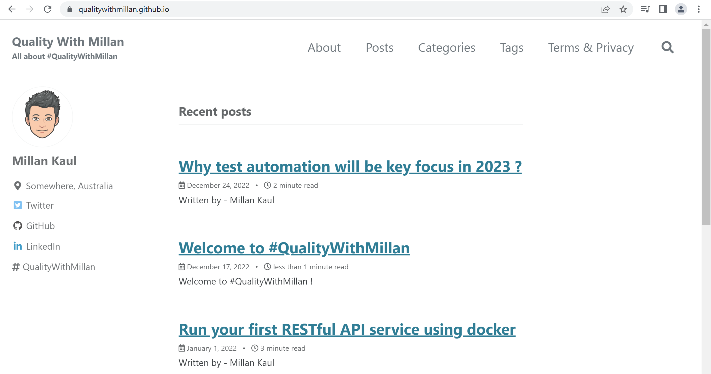
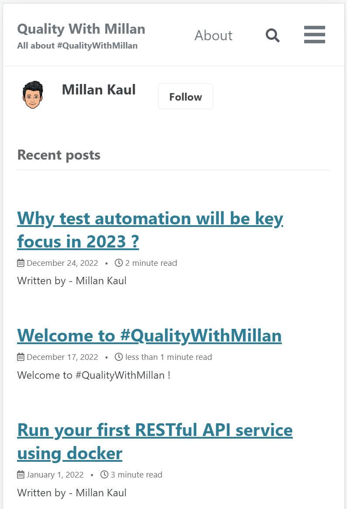

<pre>

  Become a <a href="https://github.com/sponsors/eaccmk" target="_blank">sponsor</a> support me 🤝❤️❤️‍🩹 in creating more OSS stuff
                               
  

</pre>

  <b>
    💻 Vist https://qualitywithmillan.github.io/ to see this blog post live
  </b>

 

| **Desktop**  :desktop_computer: | **Mobile** :iphone: |
|:--:|:--:|
|||

 

> ✒🖋  if you wish to co-author a blog/post with me head to [Co-Author-Instructions.md](https://github.com/QualityWithMillan/qualitywithmillan.github.io/blob/prod/Co-Author-Instructions.md)
